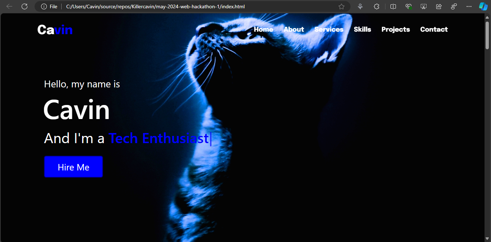
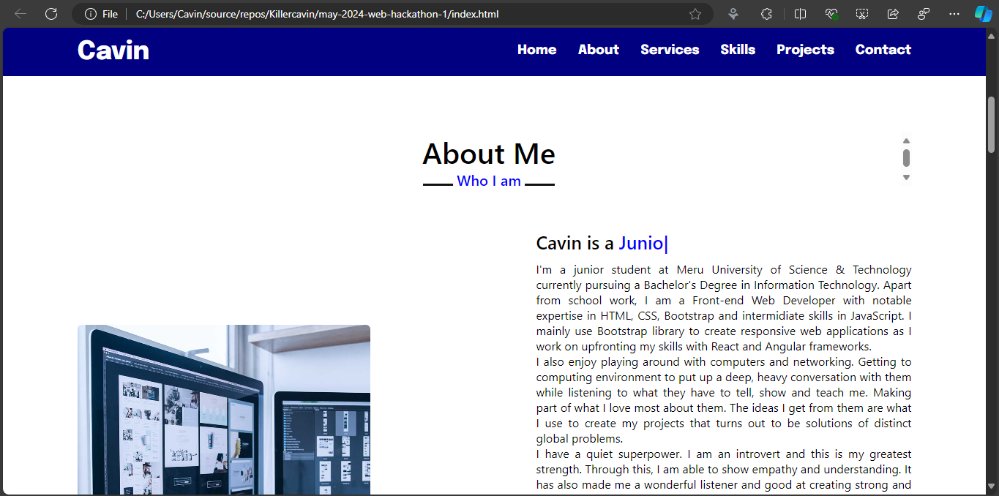
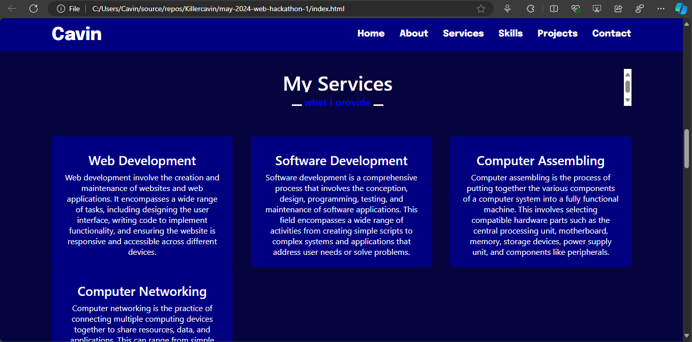
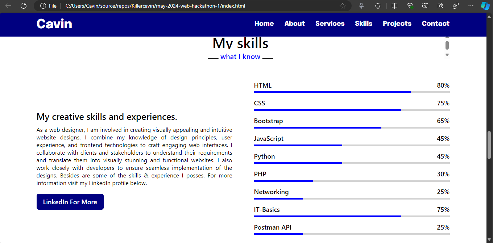
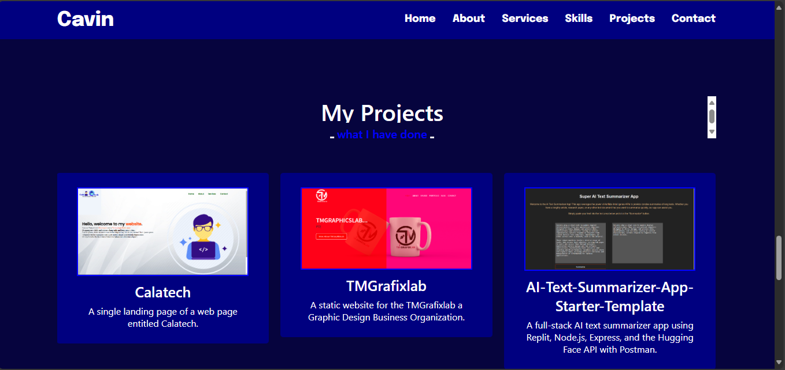
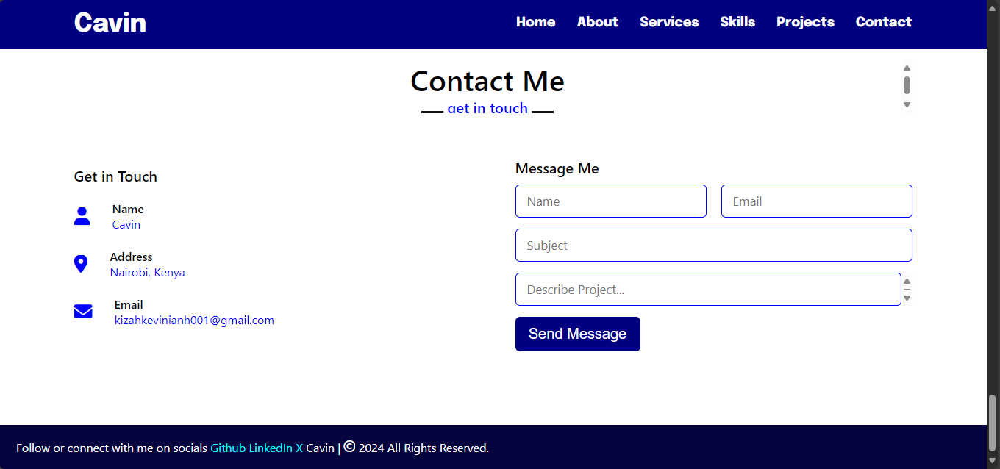

# Portfolio

This Markdown files illustrate the visual view of my portfolio in brief as of the page images

## Home Page

## About Page

## 

## 

## 

## 

## End
That is the quick view of my portfolio web page

