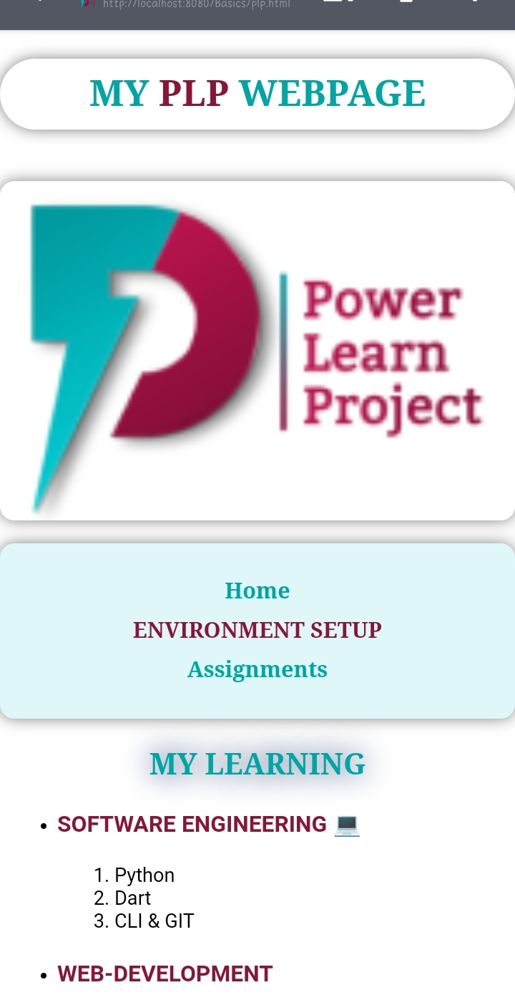
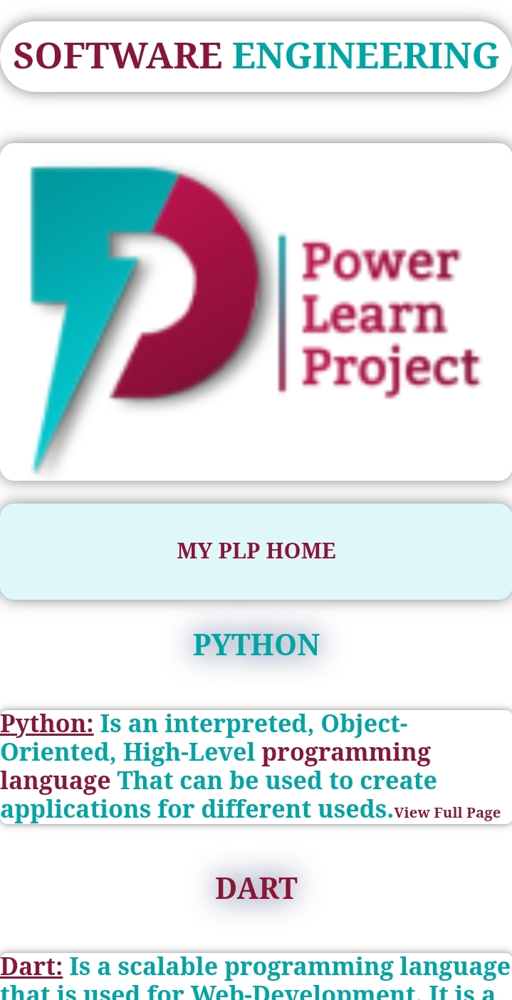
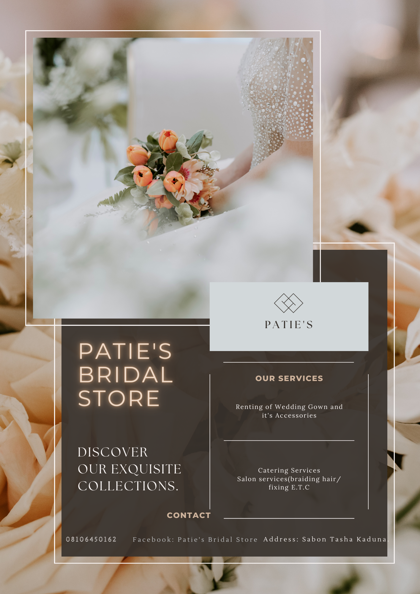

# WEB HACKATHON - 1
Welcome to My Portfolio Website Hackathon!
Below is my HTML and CSS Code which i also uploaded the files(codes and resources of my page)in this Repository thank you
## HTML CODE
<!DOCTYPE html>
<html lang="en">
<head>
    <meta charset="UTF-8">
    <meta name="viewport" content="width=device-width, initial-scale=1.0">
    <title>ISAAC BENEDICT | Portfolio</title>
    <link rel="stylesheet" href="webhackathon.css">
</head>
<body>
    <header>
        

            <h1>ISAAC BENEDICT</h1>
        

    </header>

   <section id="about">
        

            <h2>About Me</h2>
            
Hey, I am ISAAC BENEDICT, a Software Developer & Graphic Designer based in Minna, NIGERIA.

            
I specialize in creating intuitive and responsive web & graphic designs. Over the years, I have gained extensive experience working on projects involving HTML, CSS, JavaScript, Canva, Adobe Tools, and more.

            
I am passionate about improving user experience and strive to create engaging web applications that are both functional and beautiful. My goal is to continuously innovate and stay updated with the latest web technologies.

            
When I'm not working, you can find me hiking, reading sci-fi novels, or experimenting with new emerging technologies.

            
I'm always open to discussing new projects and opportunities.

            
Feel free to send me an <a href="mailto:benedictisaac258@gmail.com">Email</a>.

            

                <a href="https://www.linkedin.com/in/benedict-isaac-864931287?utm_source=share&utm_campaign=share_via&utm_content=profile&utm_medium=android_app">LinkedIn</a> |
                <a href="https://github.com/Benedict258">GitHub</a>
            

            

        

    </section>

   <section id="portfolio">
        

            <h2>Portfolio</h2>
            

                <h3>MY PLP LEARNING WEBPAGE</h3>
                

                    
                    
                

                
The project is to help me input and practice whatever I learnt from the power learn project programme in other to stay active. Below is a link to a repository with the codes of the project: <a href="https://github.com/Benedict258/MY-POWER-LEARN-WEBPAGE.git">Github Repository</a>.

                  <h3>MY Graphic Designs</h3>
                

                    
                    
                    
                

                
The project is to help me input and practice whatever I learnt from the power learn project programme in other to stay active. Below is a link to a repository with the codes of the project.

            

        

    </section>

   <section id="skills">
        

            <h2>Skills</h2>
            <ul class="skills-list">
                <li>WEB DEVELOPMENT</li>
                <li>GRAPHIC DESIGNER</li>
                <li>FREELANCER</li>
                <li>EDUCATIONAL TUTOR</li>
            </ul>
        

    </section>

   <section id="experience">
        

            <h2>Experience</h2>
            

                <h3>GRAPHIC DESIGNING & I.T CONSULTANT AT ADMIRALTY I.T PLACE</h3>
                
Duration: 2021 - 2023

                <h4>Title: Manager</h4>
                
Graphic Designer at the aboveground company and also an I.T consultant and cafe manager.</    
                <h3 style="color: #00A6A6;">BEACHES EDITS & DESIGN</h3>
                
Duration: 2023 - Present

                <h4>Title: C.E.O</h4>
                
The above company deals in creating stunning designs to reach clients' satisfaction, bringing your imaginations to reality!
   
               <h3>PATHWAY SCHOLARS</h3>
                <h4>Title: C.E.O</h4>
                
Duration: 2023 - present

                
An Online Institution where we train students academically.

                

            

        

    </section>

   <section id="education">
        

            <h2>Education</h2>
            

                <h3>HIGH SCHOOL DIPLOMA AT DOMINICAN COLLEGE DABAI</h3>
                
Graduated: 2022

                <h3>BACHELOR IN MECHATRONICS ENGINEERING AT FEDERAL UNIVERSITY OF TECHNOLOGY MINNA</h3>
                
2024 - Present

            

        

    </section>

   <section id="contact">
        

            <h2>Contact</h2>
            
Feel free to reach out via <a href="mailto:benedictisaac258@gmail.com">email</a>.

            <button class="btn">Get in Touch</button>
        

    </section>

   <footer>
        

            
&copy; 2024 Isaac Benedict

        

    </footer>
</body>
</html>

## CSS CODE
body {
    background-color: #896F96;
    color: #e0e0e0;
    font-family: Arial, sans-serif;
    margin: 0;
    padding: 0;
    background-image: url('img1.jpg');
    background-size: cover;
    background-position: center;
    background-repeat: no-repeat;
}

t {
    text-align: center;
    font-family: "Times New Roman", Times, serif;
    border-radius: 100px;
    box-shadow: 0 0 10px rgba(1, 1, 1, 0.5);
    color: #00A6A6;
}

.image-container {
    display: flex;
    flex-wrap: wrap;
    justify-content: flex-start;
    gap: 10px;
}

.image-container img {
    width: 200px;
    height: 200px;
    object-fit: cover;
    border-radius: 8px;
    border: 2px solid #ddd;
}

ul {
    text-align: left;
}

header h1 {
    color: #00A6A6;
    text-align: center;
    font-weight: bold;
    font-family: "Times New Roman", Times, serif;
    font-size: 40px;
    padding: 10px 0;
    border-radius: 100px;
    box-shadow: 0 0 10px rgba(0, 0, 0, 0.5);
}

nav {
    background-color: #e0f7fa;
    padding: 15px 0;
    border-radius: 10px;
    box-shadow: 0 0 10px rgba(0, 0, 0, 0.5);
    text-align: center;
    width: 100%;
}

nav a {
    color: #1e88e5;
    margin: 0 15px;
    text-decoration: none;
    font-size: 18px;
}

nav a.current {
    color: #ffffff;
}

nav a:hover {
    color: #03dac6;
}

@media (max-width: 600px) {
    nav a {
        display: block;
        margin: 10px 0;
    }
}

main h2,
main h3,
main h4,
.section-title {
    color: #03dac6;
}

main h3 {
    color: #bb86fc;
}

h2 {
    font-family: Georgia, serif;
    text-align: center;
    text-decoration: underline;
    text-shadow: 0 0 20px rgb(16, 35, 95);
    margin: 20px 0;
    color: #00A6A6;
}

span {
    color: #00A6A6;
}

h3 {
    color: #8B1538;
    font-family: "Times New Roman", Times, serif;
}

h4 {
    font-family: Arial, sans-serif;
}

.list-title {
    color: #bb86fc;
}

form {
    background-color: #1f1f1f;
    padding: 15px;
    border-radius: 5px;
    color: #e0e0e0;
    margin: 20px;
}

input[type="text"],
input[type="email"],
textarea {
    background-color: #2c2c2c;
    color: #ffffff;
    border: 1px solid #3c3c3c;
    border-radius: 5px;
    padding: 10px;
    width: 100%;
    margin-bottom: 10px;
    box-sizing: border-box;
}

input[type="text"]::placeholder,
input[type="email"]::placeholder,
textarea::placeholder {
    color: #888888;
}

input[type="radio"],
input[type="checkbox"] {
    margin-right: 10px;
}

label {
    color: #e0e0e0;
}

button,
input[type="submit"] {
    background-color: #03dac6;
    color: #121212;
    border: none;
    padding: 10px 20px;
    cursor: pointer;
    border-radius: 5px;
}

button:hover,
input[type="submit"]:hover {
    background-color: #018786;
}

a {
    font-weight: bold;
    color: #1e88e5;
    text-decoration: none;
    font-family: "Times New Roman", Times, serif;
}

a:hover {
    color: #bb86fc;
}

.zoom-animation {
    animation: zoom 3s infinite;
}

@keyframes zoom {
    0%,
    100% {
        transform: scale(1);
    }
    50% {
        transform: scale(1.2);
    }
}

img {
    display: block;
    margin: 0 auto;
    width: 350px;
    height: 200px;
    border-radius: 10px;
    box-shadow: 0 0 10px rgba(0, 0, 0, 0.5);
}

@media (max-width: 600px) {
    img {
        width: 100%;
        height: auto;
    }

   h1 {
        font-size: 30px;
    }
}

div {
    text-align: center;
    margin-top: 20px;
    font-family: "Times New Roman", Times, serif;
    padding: 10px 0;
    border-radius: 10px;
}
